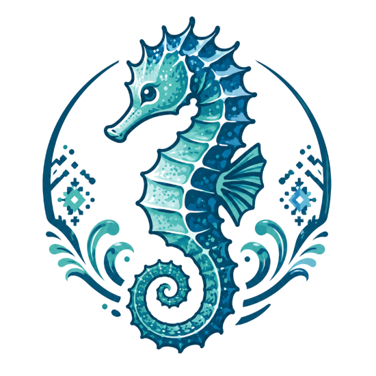
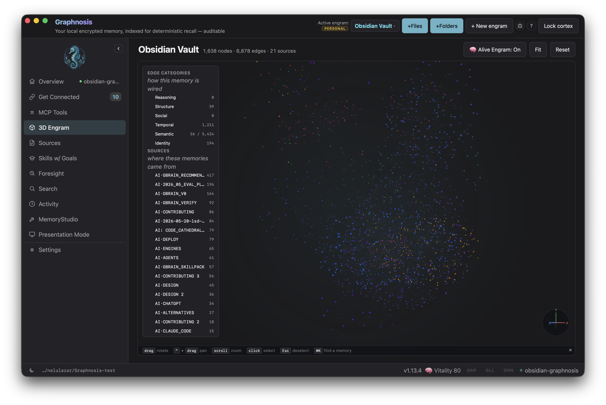
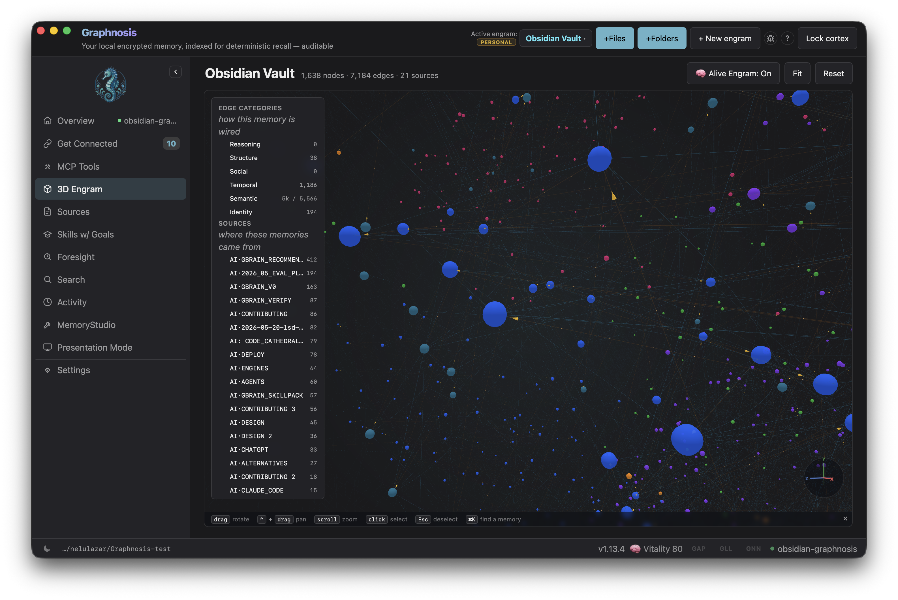

# Graphnosis for Obsidian

Indexed, local, encrypted job memory for your Obsidian vault, powered by [Graphnosis](https://graphnosis.ai).

- **Recall** — semantic search across your entire cortex from the command palette; click any result to insert it at the cursor
- **Remember** — save the current note to your encrypted cortex with a single command
- **Vault sync** — automatically push modified `.md` files to memory on save
- **Catch-up sync** — on every launch, the plugin picks up notes edited outside Obsidian (Terminal, Cursor, cloud sync) and pushes them without any action from you
- **Engram routing** — direct vault notes into a specific memory graph (engram) to keep topics cleanly separated
- **Token-budget control** — tune recall depth per query from 100 to 8,000 tokens in Settings
- **Insert at cursor** — recall results drop straight into your note; falls back to clipboard if no editor is open
- **Status bar** — live cortex vitality score so you always know the bridge is up
- **Local-only** — talks to the Graphnosis sidecar on `localhost`; AES-256-GCM encryption at rest; nothing leaves your machine

---

## Prerequisites

1. **Graphnosis desktop app** — [download here](https://graphnosis.ai/download). The app must be running and your cortex unlocked.
2. **Bearer token** — open Graphnosis → Settings → VS Code tab and copy the token shown there. (The same token works for Obsidian — it's a local-only bridge.)

---

## Installation

### Via BRAT (pre-release / beta)

1. Install the [BRAT plugin](https://github.com/TfTHacker/obsidian42-brat) from Obsidian's community plugin list.
2. Open BRAT settings → **Add Beta Plugin** → paste `nehloo-interactive/graphnosis-obsidian-plugin`.
3. Enable **Graphnosis** in Settings → Community plugins.

### Via Obsidian Marketplace (once listed)

Search "Graphnosis" in Settings → Community plugins → Browse, then install and enable.

---

## Configuration

Open Settings → Graphnosis:

| Setting | Default | Description |
|---|---|---|
| HTTP bridge URL | `http://127.0.0.1:3457/mcp` | URL of the local MCP bridge (rarely needs changing) |
| Bearer token | — | Paste from Graphnosis → Settings → VS Code tab |
| Target engram | `personal` | Engram that **Save current note** and vault sync write into |
| Enable vault sync | off | Push modified notes to memory on save |
| Max recall tokens | 2000 | Token budget per recall query (100–8000) |

Use **Test connection** to confirm the bridge is reachable after pasting the token.

> [!IMPORTANT]
> **Enabling vault sync imports your whole vault.** The first time you turn it on,
> catch-up sync treats every existing `.md` file as unsynced and pushes all of them
> to the **Target engram** in one pass (then only edited notes sync thereafter). If
> you don't want a bulk import, point **Target engram** at a dedicated engram first,
> or enable sync on a small vault. The target engram must already exist — if it
> doesn't, the Graphnosis app shows a one-click banner to create it on first write.

---

## Commands

| Command | What it does |
|---|---|
| `Search Graphnosis memory…` | Opens the recall modal — type a query, click a result to insert it |
| `Save current note to Graphnosis memory` | Pushes the full current note to your cortex |

---

## Related

- [**nehloo-interactive/graphnosis-app**](https://github.com/nehloo-interactive/graphnosis-app) — desktop app monorepo (Tauri shell, Node sidecar, VS Code extension)
- [**@nehloo/graphnosis**](https://www.npmjs.com/package/@nehloo/graphnosis) — core memory SDK (npm)
- [**nehloo-interactive/graphnosis-secure-sync**](https://github.com/nehloo-interactive/graphnosis-secure-sync) — encryption, op-log, and federation layer the SDK is built on

---

## License

Apache-2.0 — see [LICENSE](LICENSE).

---

## Demo

